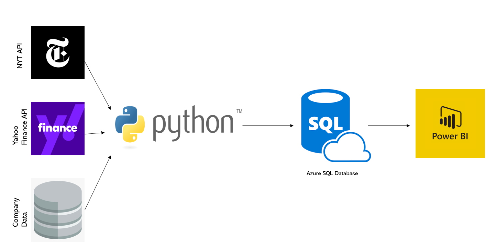
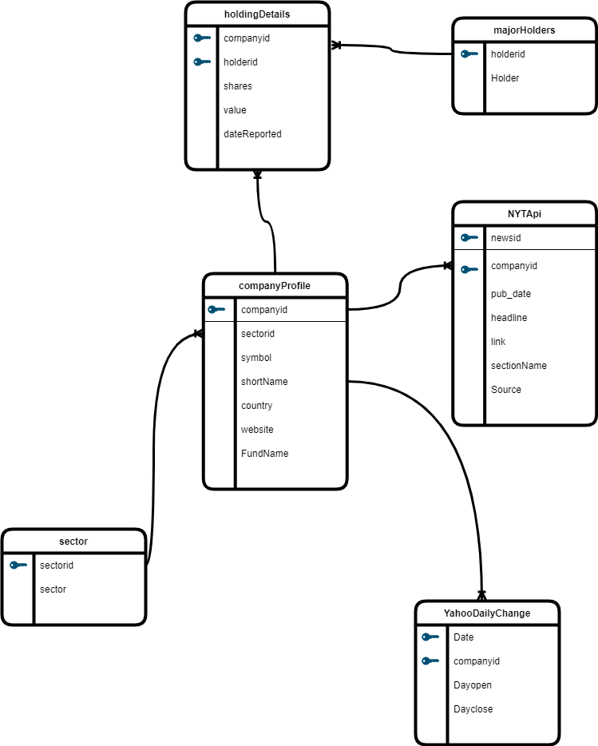

# azure_sql_etl
In this project, I built an ETL pipeline using Python and Azure SQL Database. Below is the data model and architecture. The goal of this project is to combine data from different sources for easier reporting.

